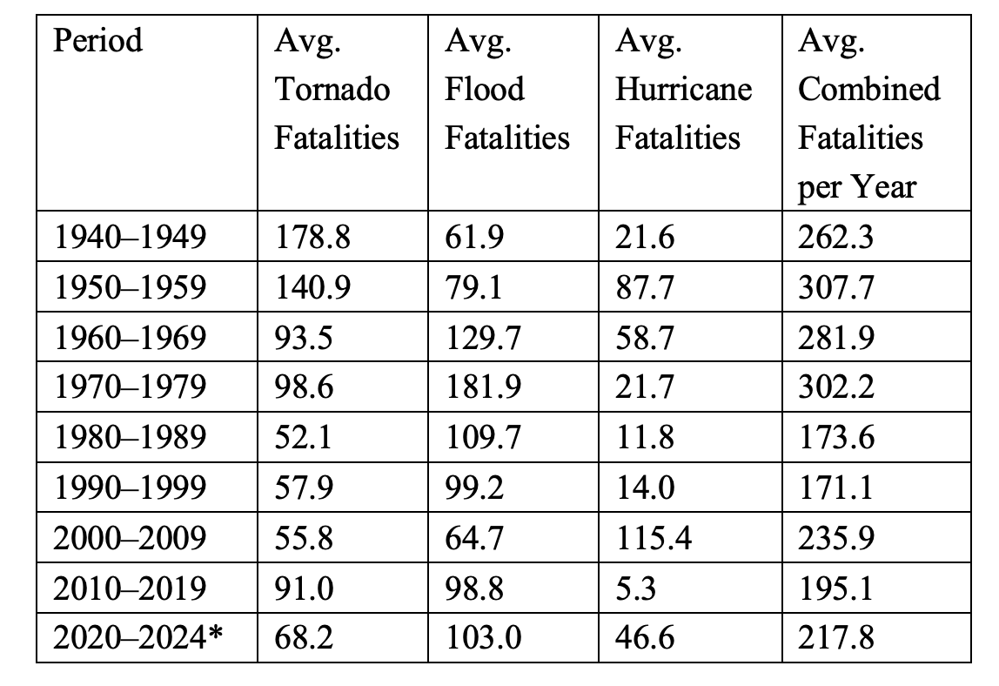
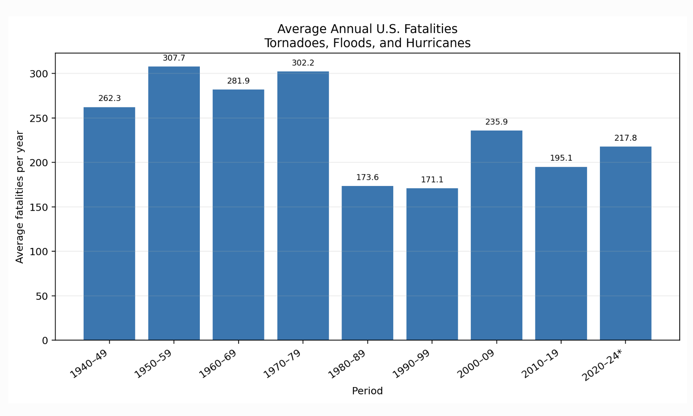
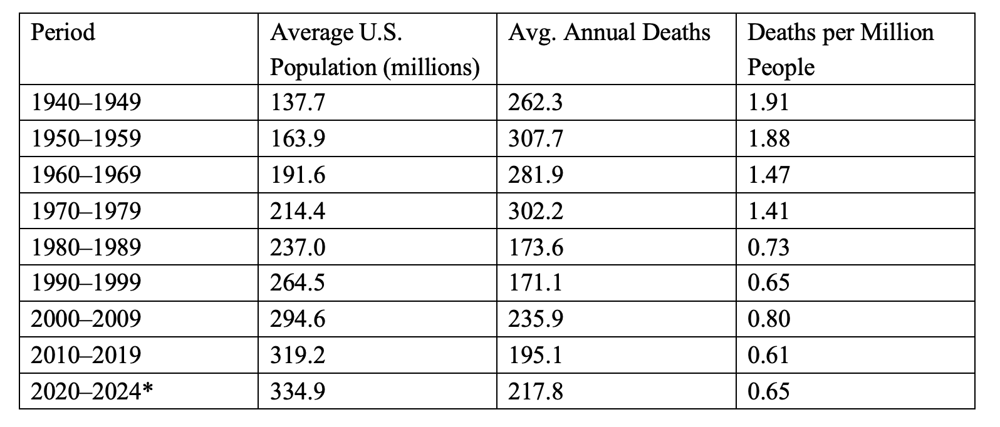
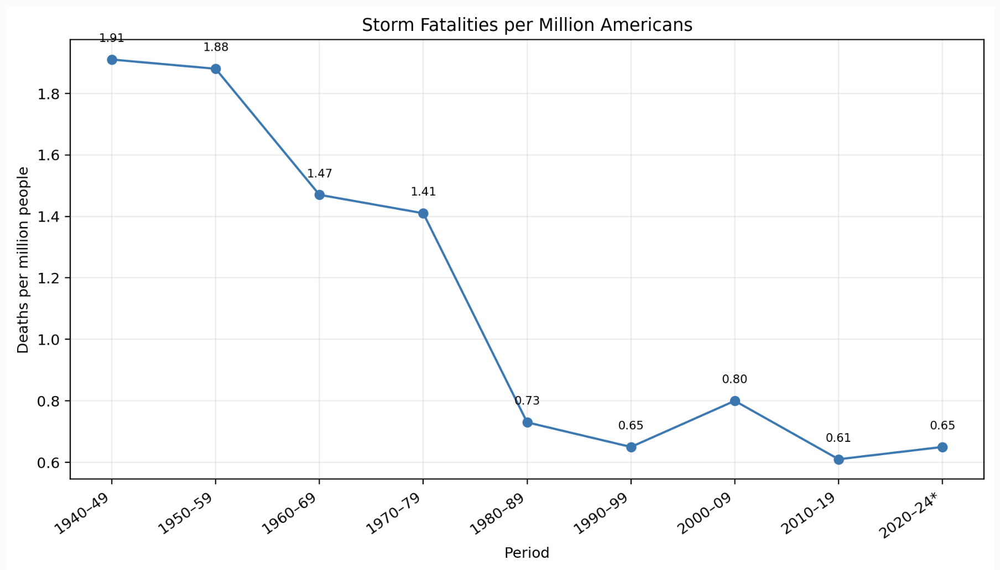
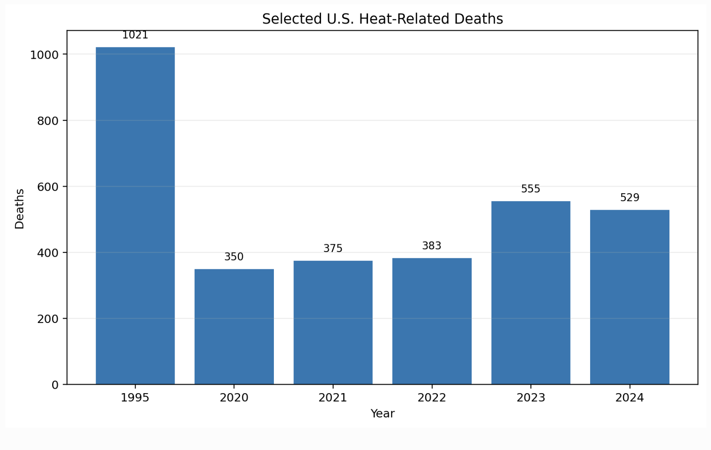

# Extreme Weather Fatalities in the United States

I used official data from the National Weather Service (NWS) to examine U.S. fatalities from tornadoes, floods, and hurricanes since 1940. The NWS data are compiled from Storm Data, which collects information from National Weather Service offices across the United States.

For each year, I added the number of tornado, flood, and hurricane fatalities together. I then grouped the annual totals by decade and calculated the average number of fatalities per year for each period.

---

## Trend in Weather-Related Fatalities

Using the same National Weather Service data, there were a total of 20,387 fatalities from tornadoes, floods, and hurricanes in the United States between 1940 and 2024.

The average number of fatalities from these three types of extreme weather was approximately **240 deaths per year** over the entire 1940–2024 period.

Looking only at tornado, flood, and hurricane deaths, I would say the general trend has gone down, but definitely not in a straight line. In the earlier decades, the average was usually around 260 to 300 deaths per year. By the 1980s and 1990s, it had dropped to around 170 deaths per year. There are still some periods where the number goes back up, so I would not say the decline is perfectly consistent.

Once I include heat and cold deaths, though, the picture gets more complicated. Heat deaths especially can change a lot from year to year. So I would not simply say that weather-related deaths are falling. A better way to put it is that deaths from tornadoes, floods, and hurricanes have generally become lower over time, but once heat and cold are included, the overall trend is much less clear.

**Source:**  
National Weather Service, 80-Year List of Severe Weather Fatalities, 1940–2024  
https://www.weather.gov/media/hazstat/80year_2024.pdf

---

## Population-Adjusted Death Intensity

The raw death numbers are useful, but the U.S. population is a lot larger now than it was in the 1940s. Because of that, I decided to use deaths per million people as my “death intensity” measure.This way, a more accurate answer can be obtained.

I calculated it as:

**Death intensity = average annual deaths ÷ average population (in millions)**

My biggest discovery is that once the population is taken into account, this decline seems more obvious. For instance, the original death toll in the 1950s was actually higher than that in the 1940s, but the mortality rate per million people was slightly lower. By the 2010s, the mortality rate was only about 0.61 per million people, while it was approximately 1.91 per million people in the 1940s. This is not a completely smooth recession. In the first decade of this century, this ratio rose again, and the period from 2020 to 2024 is not even a complete decade. Despite this, after this survey, we can more clearly see that the probability of ordinary people being exposed to these three extreme weather risks is much lower than the original total number of deaths.

**Sources:**

National Weather Service, Weather Related Fatality and Injury Statistics:  
https://www.weather.gov/hazstat

U.S. Census Bureau, Historical and Annual Population Estimates:  
https://www.census.gov/data/tables/time-series/demo/popest/pre-1980-national.html

U.S. Census Bureau, National Population Totals, 2020s:  
https://www.census.gov/data/datasets/time-series/demo/popest/2020s-national-total.html

---

## Are Americans Moving Toward Hurricane Risk?

For this part, I looked at hurricanes. I found a study that compared county-level migration in the United States from 2010 to 2020 with natural hazard risk. The migration data came from the U.S. Census Bureau, and the hurricane risk data came from FEMA.

What I find rather interesting is that this result is not as simple and straightforward as I initially thought. On the surface, regions with a higher risk of hurricanes actually have a greater inflow of population. This phenomenon indicates that places like Florida and Texas, although they have a higher risk of hurricanes, also have other more attractive aspects that attract more attention. For instance, job opportunities, housing, climate and lifestyle, etc. It seems that people give priority to these factors when moving compared to the risk of hurricanes.

However, when the researchers controlled these factors, the results changed very obviously. That is to say, if the variables such as work, income and population density are excluded and only the item of "hurricane risk" is considered, it actually makes people less willing to move in.

Therefore, this study indicates that one cannot simply say that people do not care about risks just because the population in high-risk areas is still growing. Often, people choose to move there because of other benefits rather than because they ignore the risk of hurricanes. These two are not in conflict.

**Source:**

Clark, Mahalia B., Ephraim Nkonya, and Gillian L. Galford.  
“Flocking to Fire: How Climate and Natural Hazards Shape Human Migration Across the United States.”  
*Frontiers in Human Dynamics*, 2022.  
https://www.frontiersin.org/journals/human-dynamics/articles/10.3389/fhumd.2022.886545/full

---

## Moving to Higher Ground

For this part, I assumed that large buildings last around 50 years. I also assumed that moving or rebuilding them in a safer place would cost about 10% more than replacing them in the same place. These are just rough estimates, but I think they are reasonable enough for this calculation.

The assignment says that about $600 billion of capital is in hurricane-risk areas. If these buildings are replaced over 50 years, then around:

**$600 billion ÷ 50 = $12 billion**

would be replaced each year.

If moving them to a safer place adds about 10% to the cost, then the extra cost would be:

**$12 billion × 10% = $1.2 billion per year**

If U.S. GDP is around $31 trillion, then $1.2 billion is only about **0.004% of GDP**.

For me, the main point is that this sounds much smaller than I expected. If buildings are moved in batches gradually when they need to be replaced, perhaps the cost will be much easier than moving all the buildings at once. Of course, this is a rough estimate, as the actual relocation will definitely involve other costs.

---

## Disaster Losses

From the report of SREX, I think the main reason for the increase in disaster losses is not merely that the weather itself may be changing. There are also other factors, such as more people, houses and other valuable things being located in areas that might be hit by the storm.

Another important thing is how well a place is prepared. Two places may suffer from similar storms, but the damage caused may vary greatly depending on the buildings, infrastructure, income and the number of people affected.

Therefore, I won't immediately say that the storm will definitely get worse just because I see higher disaster losses. Part of the reason for the increase might be that we have more people and property in dangerous areas.

**Source:**

IPCC, Managing the Risks of Extreme Events and Disasters to Advance Climate Change Adaptation (SREX), 2012.

https://www.ipcc.ch/report/managing-the-risks-of-extreme-events-and-disasters-to-advance-climate-change-adaptation/

---

## Heat-Related Deaths

Heat deaths look pretty different from the storm deaths I looked at earlier. Tornado, flood, and hurricane deaths generally went down over the long run, but heat deaths do not show the same clear pattern. For example, the NWS recorded 1,021 heat deaths in 1995, which was much higher than the years around it. More recently, the number has also been fairly high, with 350 deaths in 2020, 375 in 2021, 383 in 2022, 555 in 2023, and 529 in 2024.

The peak in 1995 seems significant as it indicates that temperature itself is not everything. That summer, a strong heatwave hit Chicago. The Centers for Disease Control and Prevention found that the elderly and those without air conditioning were particularly at risk.

For me, this means that dealing with higher temperatures is not just about trying to lower the temperature itself. Air conditioners, warning systems, checking on the elderly, and ensuring that people have cool places to go can also have a significant impact. If extreme high temperatures become more common, these reactions may also become more significant.

**Sources:**

National Weather Service:  
https://www.weather.gov/media/hazstat/80year_2024.pdf

CDC, Heat-Related Mortality — Chicago, July 1995:  
https://www.cdc.gov/mmwr/preview/mmwrhtml/00038443.htm

CDC, Heat-Related Deaths — Chicago, Illinois, 1996–2001, and United States, 1979–1999:  
https://www.cdc.gov/mmwr/preview/mmwrhtml/mm5226a2.htm

---

## What the Burke Paper Adds

The Burke paper changed how I looked at some of the temperature data. One thing that impressed me deeply was that the paper stated that in all the places they studied, the number of deaths caused by cold was higher than that caused by heat. Before this, I only focused on the aspect of heat. I never expected there to be such a contrast.

This paper also states that the bodies of people living in a specific area can adapt to the climate in which they live. For instance, people living in hot regions may be more adaptable to high-temperature environments than those in other areas. However, this does not mean that the risk of high temperatures will not affect them. Relatively speaking, these people have a better ability to withstand high temperatures.

Another thing I noticed is that the Burke paper and the NWS data are not measuring the same thing. The NWS data count deaths that are directly recorded as weather-related, while the Burke paper estimates temperature-attributable mortality. It is precisely for this reason that I think these figures should not be compared directly.

This paper also made me think more carefully about possible solutions. Air conditioning, heating, housing and other forms of adaptation may be helpful, but the paper also indicates that there is no very strong evidence behind some usually recommended interventions. Therefore, I think we cannot assume that every solution has the same effect, but should discuss them separately.

**Source:**

Burke, Marshall, et al. (2025). *Understanding and Addressing Temperature Impacts on Mortality.* NBER Working Paper No. 34313.

https://www.nber.org/papers/w34313
