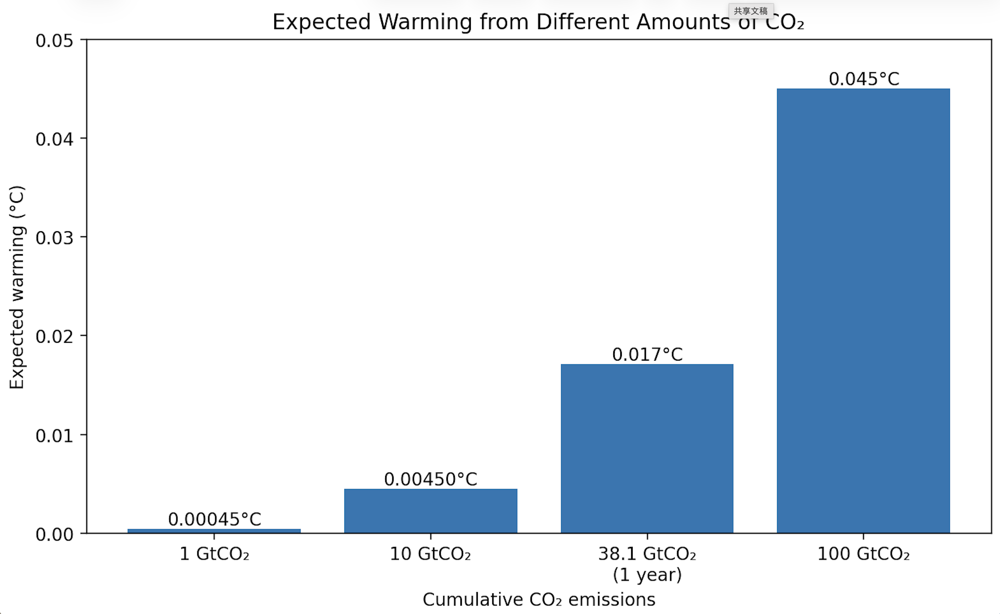

# What Does One Billion Tons of CO2 Do?

## The Question

We always hear about large amounts of carbon dioxide emissions, especially when people talk about climate change.   Figures like "1 billion tons of carbon dioxide" sound serious, but I realized that I actually didn't have a clear understanding of what this figure meant in terms of temperature.   I knew that more emissions would lead to more warming, but I really couldn't imagine how much warming a certain amount of carbon dioxide would cause.

So I wanted to make these numbers more intuitive and easier to understand.
In this project, I decided to compare 1 GtCO2, 10 GtCO2, 100 GtCO2, and about one current year of global carbon dioxide emissions.   I hope to better understand the relationship between individual amounts of emissions and long-term global warming by converting each amount into an expected temperature rise.

## What I Asked AI to Do

I used AI mainly to help me understand TCRE, find reliable estimates for it, check the units, and do the calculations. I also used it to compare the different emission amounts and think about the clearest way to show the results.

I still checked the sources and the assumptions because a small mistake in the units could change the result a lot.

## The Results

The IPCC gives a best estimate for TCRE of about 0.45°C of warming for every 1,000 GtCO2 emitted.

Using that estimate:

| CO2 Emissions | Expected Warming |
|---|---:|
| 1 GtCO2 | 0.00045°C |
| 10 GtCO2 | 0.0045°C |
| 100 GtCO2 | 0.045°C |
| 38.1 GtCO2 (about one current year of global fossil CO2 emissions) | 0.017°C |

The basic calculation is:

**Expected warming = CO2 emissions × (0.45°C / 1,000 GtCO2)**

## What This Shows

One thing that surprised me was how small the temperature change of one billion tons of carbon dioxide itself seemed. An increase of 0.00045°C is almost impossible to be noticed, especially when we usually consider one billion tons to be a very large figure. This made me realize that the size of an emission figure sounds to have a much greater impact on temperature than the figure itself.

But more importantly, carbon dioxide will accumulate over time. In this simple calculation, if emissions increase tenfold, the expected warming will also increase by approximately tenfold. This means that the main problem is not one billion tons of carbon dioxide, but rather a large amount of carbon dioxide is constantly being added to the atmosphere year after year. This will be a super large number.

At present, the annual global emissions of carbon dioxide from fossil fuels are approximately 38.1 billion tons of carbon dioxide, which means that the expected temperature increase is about 0.017 degrees Celsius. If we only look at one year, this is still a very small number. However, if emissions remain at a similar level for many years, their impact will continue to intensify. For instance, the cumulative amount of carbon dioxide represented by emissions over ten years at the same level will be far greater than that in one year.

This contrast also helped me understand why cumulative emissions are so important in climate discussions. The impact of carbon dioxide is not only related to how much is emitted in a year, but also to how much is increased over a longer period of time.

## Assumptions and Limitations

For this calculation, I used the IPCC estimate that every 1,000 GtCO2 of cumulative emissions would lead to about 0.45°C of warming.

Of course, this is only an estimate, not an exact number. The IPCC gives a possible range from about 0.27°C to 0.63°C per 1,000 GtCO2, so the real temperature change could be a little lower or higher.

This calculation is also very simplified. I am only focusing on cumulative CO2 emissions here. I did not separately include other greenhouse gases, aerosols, or short-term changes in temperature.

## Sources

- [IPCC AR6 Working Group I, Summary for Policymakers](https://www.ipcc.ch/report/ar6/wg1/chapter/summary-for-policymakers/)
- [Global Carbon Budget 2025](https://globalcarbonbudget.org/)
